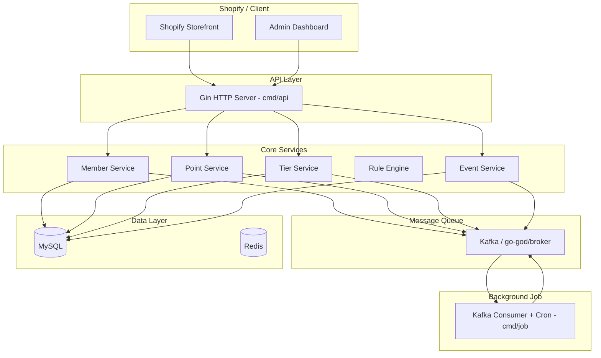
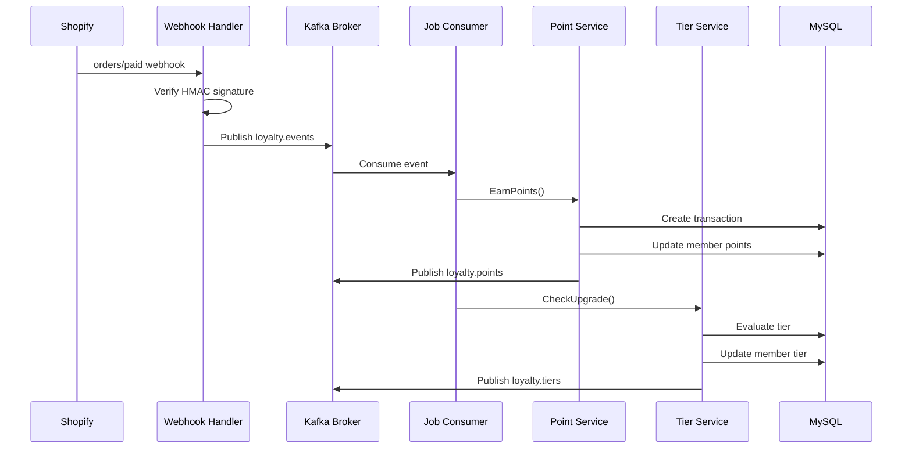
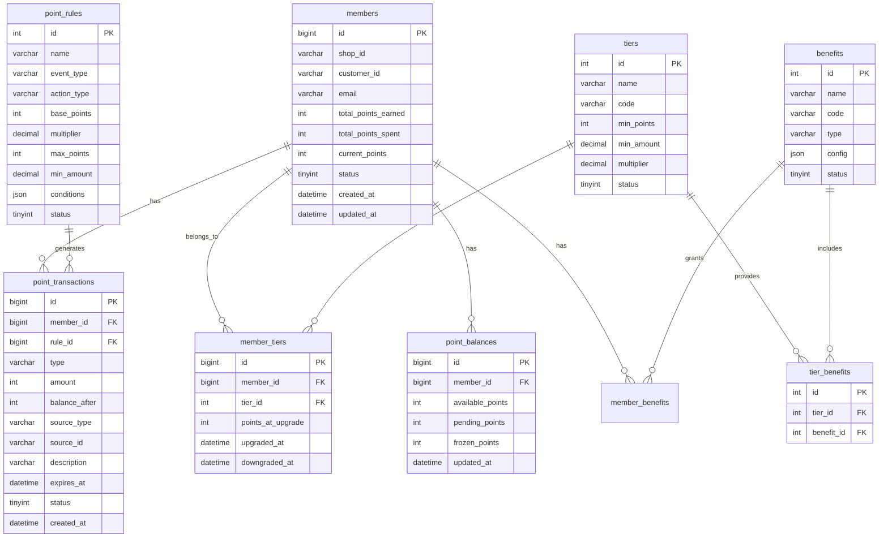

# loyalty-system

[中文](readme.cn.md)

Shopify loyalty system backend service, supporting points earning, redemption, tier progression, benefit management, and Shopify Webhook integration.

> Tech Stack: Go 1.26.4 + Gin + GORM + MySQL + Kafka + go-god/broker  
> Module: `github.com/daheige/loyalty-system`  
> Version: v1.0  
> Date: 2026-07-04

---

## Table of Contents

1. [Business Analysis](#1-business-analysis)
2. [Core Features](#2-core-features)
3. [Architecture](#3-architecture)
4. [Data Model](#4-data-model)
5. [Project Structure](#5-project-structure)
6. [Multi-tenancy](#6-multi-tenancy)
7. [Configuration](#7-configuration)
8. [API Reference](#8-api-reference)
9. [Quick Start](#9-quick-start)
10. [Docker Deployment](#10-docker-deployment)
11. [Makefile Commands](#11-makefile-commands)

---

## 1. Business Analysis

### 1.1 Core Concepts

| Concept | Description |
|---------|-------------|
| **Point** | The base currency of the loyalty system; can be earned, spent, and expired |
| **Tier** | Membership tier based on spending/points (Bronze/Silver/Gold/Platinum) |
| **Benefit** | Privileges associated with a tier (discounts, free shipping, priority support, etc.) |
| **Action** | Behaviors that trigger points (purchase, review, share, check-in, etc.) |
| **Rule** | Calculation rules for earning/spending points |
| **Transaction** | Records of point balance changes |

### 1.2 Business Scenarios

- **Earn Points**: product purchase, writing reviews, social sharing, daily check-in, birthday rewards
- **Spend Points**: deduct order amount, redeem coupons, redeem gifts
- **Tier Progression**: automatic upgrade when cumulative spending/points reach thresholds
- **Point Expiration**: set point validity period and clean up expired points regularly
- **Shopify Integration**: receive order events via Webhook and automatically issue points

### 1.3 Key Metrics

- Point earning rate, redemption rate, expiration rate
- Tier distribution, active member ratio
- Repurchase rate improvement, average order value improvement

---

## 2. Core Features

| Feature | Implementation |
|---------|----------------|
| **Point Earning** | Rule engine with multipliers, caps, and validity periods |
| **Point Spending** | Atomic deduction with balance validation |
| **Tier System** | Automatic upgrades/downgrades based on points/spending |
| **Benefit Management** | Tier-bound benefits with per-member benefit records |
| **Event-driven** | Kafka + go-god/broker async processing |
| **Shopify Integration** | Webhook receives order events and auto-earns points |
| **Deduplication** | Idempotency control based on `source_type` + `source_id` |
| **Point Expiration** | Scheduled jobs scan expired points and handle them automatically |
| **Graceful Shutdown** | HTTP server + Kafka consumers support graceful shutdown |
| **Multi-tenancy** | `shop_id` field isolation, supporting independent multi-store operations |
| **Separation of Concerns** | API service and background Job compiled and deployed independently |

---

## 3. Architecture

### 3.1 System Architecture Diagram



### 3.2 Data Flow Diagram



### 3.3 Technology Choices

| Component | Choice | Version | Description |
|-----------|--------|---------|-------------|
| Web Framework | Gin | v1.12.0 | High-performance HTTP framework |
| ORM | GORM | v1.31.2 | Auto migration and association queries |
| Database | MySQL | 8.0 | Primary storage |
| Cache | Redis | 7.x | Distributed locks and hot data caching |
| Message Queue | Kafka | 3.x | High-throughput event streaming |
| Broker SDK | go-god/broker | v1.5.0 | Unified message queue abstraction |
| Configuration | Viper | v1.21.0 | Environment variables + config files |
| Logging | Zap | v1.28.0 | Structured logging |
| JWT | golang-jwt/jwt | v5.3.0 | Token signing (HS256) and claims parsing |
| Scheduled Tasks | robfig/cron/v3 | v3.0.1 | Point expiration scanning |

---

## 4. Data Model

### 4.1 ER Diagram



### 4.2 Key Entities

Core entity definitions are located in `internal/domain/entity/`:

- `Member` / `MemberTier` / `Tier` / `Benefit` / `MemberBenefit`
- `PointTransaction` / `PointBalance`
- `PointRule`

See:

- `internal/domain/entity/member.go`
- `internal/domain/entity/point.go`
- `internal/domain/entity/rule.go`

---

## 5. Project Structure

```
loyalty-system/
├── cmd/
│   ├── api/                    # HTTP API entrypoint
│   │   └── main.go
│   └── job/                    # Background job entrypoint (Kafka consumer + Cron)
│       └── main.go
├── configs/
│   └── config.yaml             # Configuration file
├── internal/
│   ├── domain/                 # Domain layer
│   │   ├── entity/             # Domain entities
│   │   │   ├── member.go
│   │   │   ├── point.go
│   │   │   └── rule.go
│   │   └── repository/         # Repository interfaces
│   │       ├── member.go
│   │       ├── point.go
│   │       ├── tier.go
│   │       └── rule.go
│   ├── application/            # Application service layer
│   │   ├── member.go
│   │   ├── point.go
│   │   ├── tier.go
│   │   ├── event.go
│   │   └── shopify.go          # Shopify application service
│   ├── infras/                 # Infrastructure layer
│   │   ├── broker/             # Kafka wrapper
│   │   │   └── kafka.go
│   │   ├── config/             # Config loading
│   │   │   └── config.go
│   │   ├── persistence/        # Repository implementations
│   │   │   ├── member.go
│   │   │   ├── point.go
│   │   │   ├── tier.go
│   │   │   └── rule.go
│   │   ├── shopify/            # Shopify OAuth/API client
│   │   │   └── oauth.go
│   │   └── errors/             # Error definitions
│   ├── interfaces/             # Interface adapter layer
│   │   ├── handler/            # HTTP handlers
│   │   │   ├── member.go
│   │   │   ├── point.go
│   │   │   ├── tier.go
│   │   │   ├── webhook.go
│   │   │   └── shopify.go      # Shopify OAuth handler
│   │   ├── middleware/         # Middleware
│   │   │   ├── auth.go
│   │   │   └── logger.go
│   │   ├── response/           # Unified response
│   │   └── routers/            # Route registration
│   │       └── router.go
│   └── providers/              # Dependency injection / bootstrap
│       └── provider.go
├── scripts/
│   └── init.sql                # Database initialization script
├── docker-compose.yml          # Docker Compose configuration
├── Dockerfile                  # API service image
├── loyalty-job.Dockerfile      # Background Job image
├── Makefile                    # Build scripts
├── api.md                      # API interface documentation
├── shopify_verify.md           # Shopify Webhook signature verification doc
├── README.md                   # Project documentation
├── go.mod                      # Go module definition
└── go.sum                      # Go dependency checksum
```

### 5.1 Layer Descriptions

| Layer | Directory | Responsibility |
|-------|-----------|----------------|
| Domain | `internal/domain` | Entities, repository interfaces, business core |
| Application | `internal/application` | Service orchestration, transactions, event handling |
| Infrastructure | `internal/infras` | Database, message queue, configuration, error definitions |
| Interface | `internal/interfaces` | HTTP handlers, middleware, unified response, routing |
| Bootstrap | `internal/providers` | Dependency injection and lifecycle management |

---

## 6. Multi-tenancy

This system adopts a **shared database + shared schema + row-level isolation** multi-tenant architecture, isolated by the `shop_id` field.

| Layer | Strategy | Description |
|-------|----------|-------------|
| Data | Row-level isolation | All business tables contain a `shop_id` field; queries are automatically filtered |
| Cache | Namespace isolation | Redis key prefix: `loyalty:{shop_id}:` |
| Message | Topic partitioning | Partitioned by `shop_id` to ensure in-order event processing per store |
| Config | Independent config | Each store has independent point rules and tier configurations |

---

## 7. Configuration

### 7.1 configs/config.yaml

```yaml
app:
  name: loyalty-system
  env: development
  port: 8080

database:
  driver: mysql
  host: localhost
  port: 3306
  username: root
  password: password
  database: loyalty_system
  max_open_conns: 100
  max_idle_conns: 10

redis:
  host: localhost
  port: 6379
  password: ""
  db: 0

kafka:
  brokers:
    - localhost:9092
  group_id: loyalty-consumer
  target_topics:
    - type: events
      topic: loyalty.events
    - type: points
      topic: loyalty.points
    - type: tiers
      topic: loyalty.tiers

shopify:
  api_key: ${SHOPIFY_API_KEY}
  api_secret: ${SHOPIFY_API_SECRET}
  webhook_secret: ${SHOPIFY_WEBHOOK_SECRET}

jwt:
  secret: your-jwt-secret-key
  expires: 24h
```

### 7.2 Environment Variable Overrides

Viper supports automatic environment variable overrides for config files:

```bash
export APP_ENV=production
export DATABASE_HOST=prod-mysql.internal
export DATABASE_PASSWORD=secure-password
export KAFKA_BROKERS=kafka-1:9092,kafka-2:9092
export SHOPIFY_WEBHOOK_SECRET=whsec_xxx
export JWT_SECRET=jwt-secret-2026
```

### 7.3 Kafka Topic Mapping

Kafka topics are dynamically mapped by business type via `target_topics`:

| Business Type | Default Topic | Event Examples |
|---------------|---------------|----------------|
| events | loyalty.events | order.paid, review.created, member.checkin |
| points | loyalty.points | points.earned, points.spent, points.expired |
| tiers | loyalty.tiers | tier.upgraded, tier.downgraded |

The Broker provides a `ResolveTopic(eventType)` method to resolve the target topic from the event type, passing the topic explicitly on publish/subscribe.

### 7.4 Shopify Configuration Parameters

The `shopify` node configures credentials required for integration with Shopify:

| Parameter | Description | Typical Length/Format | How to Obtain |
|-----------|-------------|----------------------|---------------|
| `api_key` | Shopify App API Key (client identifier) | 32-character hex string | Shopify Partner Dashboard / App settings |
| `api_secret` | Shopify App API Secret (client secret) | 32-character hex string | Shopify Partner Dashboard / App settings |
| `webhook_secret` | Key used to verify Shopify Webhook HMAC signature | Recommended ≥32 random chars; Shopify auto-generates 32-character hex strings | Specify when creating the webhook or auto-generated by Shopify |
| `redirect_uri` | Shopify OAuth redirect URI | URL string, must match App settings | Configure in App whitelist |
| `scopes` | Shopify OAuth requested permission scopes | Comma-separated permission string | Apply according to business needs |

Notes:

- `api_key` and `api_secret` are used together for OAuth, Admin API, and other authentication.
- `webhook_secret` is used to verify the `X-Shopify-Hmac-Sha256` request header and ensure callbacks come from Shopify.
- The webhook signature algorithm is **HMAC-SHA256**, computed over the raw request body and placed in the header as **base64**.
- `redirect_uri` and `scopes` are used to generate the Shopify App installation authorization link and exchange for `access_token`.
- In production, always inject these sensitive values via environment variables; do not hard-code them in `config.yaml`.

Example configuration:

```yaml
shopify:
  api_key: ${SHOPIFY_API_KEY}
  api_secret: ${SHOPIFY_API_SECRET}
  webhook_secret: ${SHOPIFY_WEBHOOK_SECRET}
  redirect_uri: ${SHOPIFY_REDIRECT_URI:-http://localhost:8080/api/v1/shopify/callback}
  scopes: ${SHOPIFY_SCOPES:-read_orders,read_customers}
```

---

## 8. API Reference

### 8.0 Authentication

All `/api/v1/*` endpoints require JWT authentication:

```http
Authorization: Bearer <jwt_token>
```

The JWT token is **HS256** signed using the `jwt.secret` configured in `configs/config.yaml`. The token must contain a `shop_id` claim identifying the tenant.

**Token generation:**

```go
import "github.com/daheige/loyalty-system/internal/interfaces/middleware"

token, _ := middleware.GenerateToken("your-jwt-secret-key", "demo-shop.myshopify.com", 24*time.Hour)
```

The middleware validates: signature (HMAC-SHA256), token expiry, algorithm type, and non-empty `shop_id`. After validation, `shop_id` is injected into the Gin context for downstream handlers.

### 8.1 Member APIs

#### Register Member

```http
POST /api/v1/members
Content-Type: application/json
Authorization: Bearer <token>

{
  "shop_id": "demo-shop.myshopify.com",
  "customer_id": "1234567890",
  "email": "customer@example.com"
}
```

#### Query Member

```http
GET /api/v1/members?shop_id=demo-shop.myshopify.com&customer_id=1234567890
Authorization: Bearer <token>
```

#### Paginated Member List

```http
GET /api/v1/members/list?shop_id=demo-shop.myshopify.com&page=1&page_size=20
Authorization: Bearer <token>
```

### 8.2 Point APIs

#### Earn Points

```http
POST /api/v1/points/earn
Content-Type: application/json
Authorization: Bearer <token>

{
  "member_id": 1,
  "action_type": "purchase",
  "amount": 150.00,
  "source_type": "order",
  "source_id": "order_12345",
  "description": "Order #12345 - $150.00",
  "expires_in_days": 365
}
```

#### Spend Points

```http
POST /api/v1/points/spend
Content-Type: application/json
Authorization: Bearer <token>

{
  "member_id": 1,
  "points": 100,
  "source_type": "order_discount",
  "source_id": "order_12345",
  "description": "Discount for order #12345"
}
```

#### Query Point Balance

```http
GET /api/v1/points/balance/1
Authorization: Bearer <token>
```

#### Query Point Transactions

```http
GET /api/v1/points/transactions/1?page=1&page_size=20
Authorization: Bearer <token>
```

### 8.3 Tier APIs

#### Get All Tiers

```http
GET /api/v1/tiers
Authorization: Bearer <token>
```

#### Get Member Current Tier

```http
GET /api/v1/tiers/member/1
Authorization: Bearer <token>
```

#### Manual Tier Upgrade Check

```http
POST /api/v1/tiers/check/1
Authorization: Bearer <token>
```

### 8.4 Webhook APIs

#### Shopify Order Paid Callback

```http
POST /webhooks/shopify/order-paid
X-Shopify-Topic: orders/paid
X-Shopify-Hmac-Sha256: <hmac_signature>
X-Shopify-Shop-Domain: demo-shop.myshopify.com

{
  "id": 1234567890,
  "customer": {
    "id": 9876543210,
    "email": "customer@example.com"
  },
  "total_price": "150.00",
  "currency": "USD",
  "shop_domain": "demo-shop.myshopify.com"
}
```

### 8.5 Shopify OAuth APIs

#### Initiate Authorization Install

```http
GET /api/v1/shopify/auth?shop=demo-shop.myshopify.com&state=loyalty-system
```

Response: 302 redirect to the Shopify authorization page.

#### Authorization Callback

```http
GET /api/v1/shopify/callback?shop=demo-shop.myshopify.com&code=xxxxx&hmac=xxxxx&state=loyalty-system&timestamp=1234567890
```

Response:

```json
{
  "code": 0,
  "message": "success",
  "data": {
    "shop": "demo-shop.myshopify.com",
    "state": "loyalty-system",
    "access_token": "shpat_xxxxxxxxxxxxxxxxxxxxxxxxxxxxxxxx",
    "webhook_secret": "xxxxx"
  }
}
```

Notes:

- The callback endpoint verifies the `hmac` signature and exchanges `api_key` + `api_secret` for an `access_token`.
- The obtained `access_token` can be used for subsequent Shopify Admin API calls (e.g., querying orders, customer details).
- In production, it is recommended to persist `access_token` to the database rather than returning it directly to the frontend.

---

## 9. Quick Start

### 9.1 Requirements

- Go 1.26.4+
- Docker & Docker Compose
- Make

### 9.2 Start Infrastructure

```bash
# Start MySQL + Redis + Zookeeper + Kafka
make docker-up

# Or start only dependency services
make dev
```

### 9.3 Initialize Database

```bash
make migrate
```

### 9.4 Start Services

```bash
# Start API service
make run

# Or build and run
make build-api
./bin/loyalty-system

# Start background Job (Kafka consumer + point expiration scheduled task)
make run-job

# Or build and run
make build-job
./bin/loyalty-system-job
```

### 9.5 Verify Service

```bash
curl http://localhost:8080/health
```

### 9.6 Test APIs

```bash
# Generate a JWT token (using the GenerateToken helper from middleware):
# token, err := middleware.GenerateToken("your-jwt-secret-key", "demo-shop.myshopify.com", 24*time.Hour)

# Or directly request, the middleware uses HS256 signed token with shop_id claim:
TOKEN="eyJ..."  # replace with a valid JWT

# Register member
curl -X POST http://localhost:8080/api/v1/members \
  -H "Content-Type: application/json" \
  -H "Authorization: Bearer $TOKEN" \
  -d '{"shop_id": "demo-shop.myshopify.com", "customer_id": "12345", "email": "test@example.com"}'

# Earn points
curl -X POST http://localhost:8080/api/v1/points/earn \
  -H "Content-Type: application/json" \
  -H "Authorization: Bearer $TOKEN" \
  -d '{"member_id": 1, "action_type": "purchase", "amount": 200, "source_type": "order", "source_id": "order_001"}'

# Query balance
curl http://localhost:8080/api/v1/points/balance/1 \
  -H "Authorization: Bearer $TOKEN"
```

---

## 10. Docker Deployment

### 10.1 Dockerfile

The project provides two independent Dockerfiles:

| File | Purpose | Build Target |
|------|---------|--------------|
| `Dockerfile` | API service image | `./cmd/api` |
| `loyalty-job.Dockerfile` | Background Job image | `./cmd/job` |

#### Build and Run API

```bash
docker build -t loyalty-system:latest .
docker run -p 8080:8080 loyalty-system:latest
```

#### Build and Run Job

```bash
docker build -f loyalty-job.Dockerfile -t loyalty-system-job:latest .
docker run loyalty-system-job:latest
```

#### Makefile Approach

```bash
make docker-build       # Build API image
make docker-build-job   # Build Job image
```

### 10.2 docker-compose.yml

```yaml
version: '3.8'

services:
  app:
    build:
      context: .
      dockerfile: Dockerfile
    ports:
      - "8080:8080"
    environment:
      - APP_ENV=production
      - DATABASE_HOST=mysql
      - DATABASE_PORT=3306
      - DATABASE_USERNAME=root
      - DATABASE_PASSWORD=loyalty_pass
      - DATABASE_DATABASE=loyalty_system
      - REDIS_HOST=redis
      - REDIS_PORT=6379
      - KAFKA_BROKERS=kafka:9092
      - SHOPIFY_WEBHOOK_SECRET=${SHOPIFY_WEBHOOK_SECRET}
      - JWT_SECRET=${JWT_SECRET}
    depends_on:
      mysql:
        condition: service_healthy
      redis:
        condition: service_started
      kafka:
        condition: service_healthy

  job:
    build:
      context: .
      dockerfile: loyalty-job.Dockerfile
    environment:
      - APP_ENV=production
      - DATABASE_HOST=mysql
      - DATABASE_PORT=3306
      - DATABASE_USERNAME=root
      - DATABASE_PASSWORD=loyalty_pass
      - DATABASE_DATABASE=loyalty_system
      - REDIS_HOST=redis
      - REDIS_PORT=6379
      - KAFKA_BROKERS=kafka:9092
      - SHOPIFY_WEBHOOK_SECRET=${SHOPIFY_WEBHOOK_SECRET}
      - JWT_SECRET=${JWT_SECRET}
    depends_on:
      mysql:
        condition: service_healthy
      redis:
        condition: service_started
      kafka:
        condition: service_healthy

  mysql:
    image: mysql:8.0
    environment:
      - MYSQL_ROOT_PASSWORD=loyalty_pass
      - MYSQL_DATABASE=loyalty_system
      - MYSQL_CHARACTER_SET_SERVER=utf8mb4
      - MYSQL_COLLATION_SERVER=utf8mb4_unicode_ci
    ports:
      - "3306:3306"
    volumes:
      - mysql_data:/var/lib/mysql
      - ./scripts/init.sql:/docker-entrypoint-initdb.d/init.sql
    healthcheck:
      test: ["CMD", "mysqladmin", "ping", "-h", "localhost", "-u", "root", "-p$$MYSQL_ROOT_PASSWORD"]
      interval: 10s
      timeout: 5s
      retries: 5

  redis:
    image: redis:7-alpine
    ports:
      - "6379:6379"
    volumes:
      - redis_data:/data

  zookeeper:
    image: confluentinc/cp-zookeeper:7.5.0
    environment:
      ZOOKEEPER_CLIENT_PORT: 2181
      ZOOKEEPER_TICK_TIME: 2000

  kafka:
    image: confluentinc/cp-kafka:7.5.0
    depends_on:
      - zookeeper
    ports:
      - "9092:9092"
    environment:
      KAFKA_BROKER_ID: 1
      KAFKA_ZOOKEEPER_CONNECT: zookeeper:2181
      KAFKA_ADVERTISED_LISTENERS: PLAINTEXT://kafka:9092
      KAFKA_OFFSETS_TOPIC_REPLICATION_FACTOR: 1
      KAFKA_AUTO_CREATE_TOPICS_ENABLE: "true"
    healthcheck:
      test: ["CMD", "kafka-broker-api-versions", "--bootstrap-server", "localhost:9092"]
      interval: 10s
      timeout: 5s
      retries: 5

volumes:
  mysql_data:
  redis_data:
```

> `app` and `job` are split into independent services using `Dockerfile` and `loyalty-job.Dockerfile` respectively, avoiding co-location of API and background tasks.

### 10.3 Database Initialization

Database schema and default data are in `scripts/init.sql`, including:

- Member, point, tier, and benefit tables
- Default tiers (Bronze/Silver/Gold/Platinum)
- Default benefit-to-tier bindings
- Default point rules (purchase, review, check-in, registration, referral)

---

## 11. Makefile Commands

```makefile
.PHONY: build build-api build-job run run-job test clean docker-build image docker-up docker-down logs migrate fmt lint swagger deps dev dev-job bench cover help

APP_NAME = loyalty-system
DOCKER_COMPOSE := $(shell if command -v docker-compose >/dev/null 2>&1; then echo docker-compose; else echo docker compose; fi)
GO = go

.DEFAULT_GOAL := help

help: ## Show available commands
	@grep -E '^[a-zA-Z_-]+:.*?## .*$$' $(MAKEFILE_LIST) | sort | awk 'BEGIN {FS = ":.*?## "}; {printf "\033[36m%-15s\033[0m %s\n", $$1, $$2}'

build: build-api build-job ## Compile both api and job binaries

build-api: ## Compile API service
	$(GO) build -o bin/$(APP_NAME) ./cmd/api

build-job: ## Compile background Job service
	$(GO) build -o bin/$(APP_NAME)-job ./cmd/job

run: ## Run API service in development mode
	$(GO) run ./cmd/api

run-job: ## Run background Job service in development mode
	$(GO) run ./cmd/job

test: ## Run tests
	$(GO) test -v ./...

clean: ## Clean build artifacts
	rm -rf bin/
	$(GO) clean

docker-build: ## Build Docker image
	docker build -t $(APP_NAME):latest .

image: docker-build ## Build Docker image (alias)

docker-up: ## Start all Docker Compose services
	$(DOCKER_COMPOSE) up -d

docker-down: ## Stop and remove Docker Compose services
	$(DOCKER_COMPOSE) down -v

logs: ## View app service logs
	$(DOCKER_COMPOSE) logs -f app

migrate: ## Execute database initialization script
	$(DOCKER_COMPOSE) exec -T mysql mysql -u root -ployalty_pass loyalty_system < scripts/init.sql

fmt: ## Format Go code
	$(GO) fmt ./...

lint: ## Run golangci-lint
	golangci-lint run ./...

swagger: ## Generate Swagger documentation
	swag init -g cmd/api/main.go

deps: ## Tidy and download dependencies
	$(GO) mod tidy
	$(GO) mod download

dev: ## Start infrastructure and run API service
	$(DOCKER_COMPOSE) up -d mysql redis zookeeper kafka
	sleep 10
	$(GO) run ./cmd/api

dev-job: ## Start infrastructure and run background Job service
	$(DOCKER_COMPOSE) up -d mysql redis zookeeper kafka
	sleep 10
	$(GO) run ./cmd/job

bench: ## Run benchmark tests
	$(GO) test -bench=. -benchmem ./...

cover: ## Generate test coverage report
	$(GO) test -coverprofile=coverage.out ./...
	$(GO) tool cover -html=coverage.out -o coverage.html
```

---

## Appendix: Core Features Summary

| Feature | Implementation |
|---------|----------------|
| **Point Earning** | Rule engine with multipliers, caps, and validity periods |
| **Point Spending** | Atomic deduction with balance validation |
| **Tier System** | Automatic upgrades/downgrades based on points/spending |
| **Benefit Management** | Tier-bound benefits with per-member benefit records |
| **Event-driven** | Kafka + go-god/broker async processing |
| **Shopify Integration** | Webhook receives order events and auto-earns points |
| **Deduplication** | Idempotency control based on `source_type` + `source_id` |
| **Point Expiration** | Scheduled jobs scan expired points and handle them automatically |
| **Graceful Shutdown** | HTTP server + Kafka consumers support graceful shutdown |
| **Multi-tenancy** | `shop_id` field isolation, supporting independent multi-store operations |
| **API/Job Separation** | `cmd/api` handles HTTP; `cmd/job` handles message consumption and scheduled tasks |

---

*Document Version: v1.0 | Last Updated: 2026-07-04*
