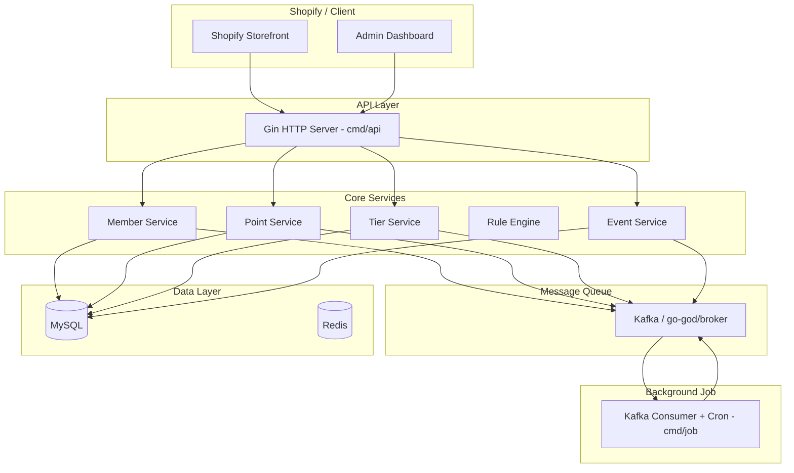
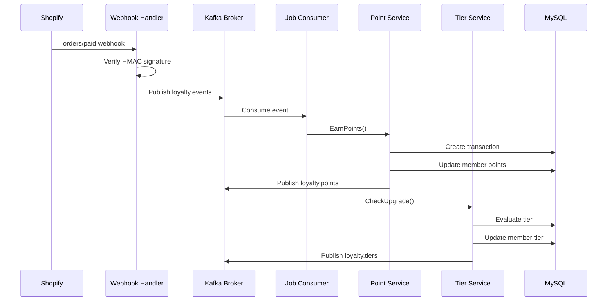
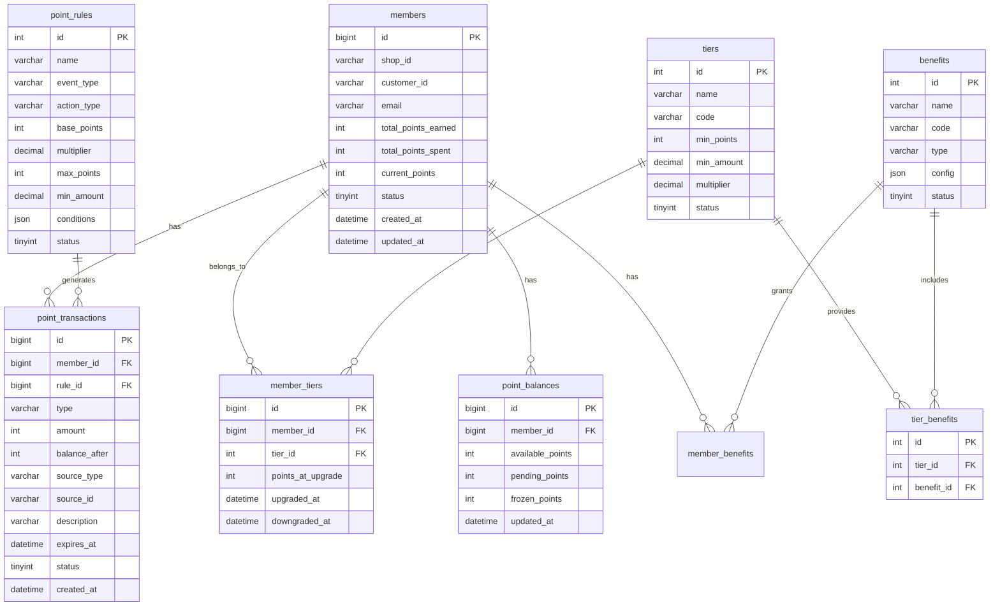

# loyalty-system

[English](README.md)

Shopify 忠诚度体系后端服务，支持积分赚取、消费、等级晋升、权益管理与 Shopify Webhook 集成。

> 技术栈：Go 1.26.4 + Gin + GORM + MySQL + Kafka + go-god/broker  
> 模块：`github.com/daheige/loyalty-system`  
> 版本：v1.0  
> 日期：2026-07-04

---

## 目录

1. [业务分析](#一业务分析)
2. [核心特性](#二核心特性)
3. [架构设计](#三架构设计)
4. [数据模型](#四数据模型)
5. [项目结构](#五项目结构)
6. [多租户设计](#六多租户设计)
7. [配置文件](#七配置文件)
8. [API 接口](#八api-接口)
9. [快速开始](#九快速开始)
10. [Docker 部署](#十docker-部署)
11. [Makefile 命令](#十一makefile-命令)

---

## 一、业务分析

### 1.1 核心概念

| 概念 | 说明 |
|------|------|
| **积分(Point)** | 忠诚度体系的基础货币，可赚取、消费、过期 |
| **等级(Tier)** | 基于消费金额/积分的会员等级（Bronze/Silver/Gold/Platinum） |
| **权益(Benefit)** | 等级对应的特权（折扣、免运费、优先客服等） |
| **行为(Action)** | 触发积分的行为（购买、评价、分享、签到等） |
| **规则(Rule)** | 积分赚取/消费的计算规则 |
| **交易(Transaction)** | 积分变动的记录 |

### 1.2 业务场景

- **赚取积分**：购买商品、写评价、社交媒体分享、每日签到、生日奖励
- **消费积分**：抵扣订单金额、兑换优惠券、兑换礼品
- **等级晋升**：累计消费/积分达到阈值自动升级
- **积分过期**：设置积分有效期，定期清理过期积分
- **Shopify 集成**：通过 Webhook 接收订单事件，自动发放积分

### 1.3 关键指标

- 积分赚取率、兑换率、过期率
- 等级分布、活跃会员占比
- 复购率提升、客单价提升

---

## 二、核心特性

| 特性 | 实现方式 |
|------|----------|
| **积分赚取** | 基于规则引擎，支持多倍率、上限、有效期 |
| **积分消费** | 原子性扣减，支持余额校验 |
| **等级体系** | 自动升降级，基于积分/消费金额 |
| **权益管理** | 等级绑定权益，会员独立权益记录 |
| **事件驱动** | Kafka + go-god/broker 异步处理 |
| **Shopify 集成** | Webhook 接收订单事件，自动赚取积分 |
| **防重复** | 基于 `source_type` + `source_id` 幂等控制 |
| **积分过期** | 定时任务扫描过期积分，自动处理 |
| **优雅关闭** | HTTP + Kafka 消费者支持 graceful shutdown |
| **多租户** | `shop_id` 字段隔离，支持多店铺独立运营 |
| **职责分离** | API 服务与后台 Job 分别编译、独立部署 |

---

## 三、架构设计

### 3.1 系统架构图



### 3.2 数据流图



### 3.3 技术选型

| 组件 | 选型 | 版本 | 说明 |
|------|------|------|------|
| Web 框架 | Gin | v1.12.0 | 高性能 HTTP 框架 |
| ORM | GORM | v1.31.2 | 自动迁移、关联查询 |
| 数据库 | MySQL | 8.0 | 主存储 |
| 缓存 | Redis | 7.x | 分布式锁、热点数据缓存 |
| 消息队列 | Kafka | 3.x | 高吞吐事件流 |
| Broker SDK | go-god/broker | v1.5.0 | 统一消息队列抽象 |
| 配置管理 | Viper | v1.21.0 | 环境变量 + 配置文件 |
| 日志 | Zap | v1.28.0 | 结构化日志 |
| JWT | golang-jwt/jwt | v5.3.0 | Token 签名（HS256）与声明解析 |
| 定时任务 | robfig/cron/v3 | v3.0.1 | 积分过期扫描 |

---

## 四、数据模型

### 4.1 ER 图



### 4.2 关键实体

核心实体定义位于 `internal/domain/entity/`：

- `Member` / `MemberTier` / `Tier` / `Benefit` / `MemberBenefit`
- `PointTransaction` / `PointBalance`
- `PointRule`

详见：

- `internal/domain/entity/member.go`
- `internal/domain/entity/point.go`
- `internal/domain/entity/rule.go`

---

## 五、项目结构

```
loyalty-system/
├── cmd/
│   ├── api/                    # HTTP API 入口
│   │   └── main.go
│   └── job/                    # 后台任务入口（Kafka 消费 + Cron）
│       └── main.go
├── configs/
│   └── config.yaml             # 配置文件
├── internal/
│   ├── domain/                 # 领域层
│   │   ├── entity/             # 领域实体
│   │   │   ├── member.go
│   │   │   ├── point.go
│   │   │   └── rule.go
│   │   └── repository/         # 仓储接口
│   │       ├── member.go
│   │       ├── point.go
│   │       ├── tier.go
│   │       └── rule.go
│   ├── application/            # 应用服务层
│   │   ├── member.go
│   │   ├── point.go
│   │   ├── tier.go
│   │   ├── event.go
│   │   └── shopify.go          # Shopify 应用服务
│   ├── infras/                 # 基础设施层
│   │   ├── broker/             # Kafka 封装
│   │   │   └── kafka.go
│   │   ├── config/             # 配置加载
│   │   │   └── config.go
│   │   ├── persistence/        # 仓储实现
│   │   │   ├── member.go
│   │   │   ├── point.go
│   │   │   ├── tier.go
│   │   │   └── rule.go
│   │   ├── shopify/            # Shopify OAuth/API 客户端
│   │   │   └── oauth.go
│   │   └── errors/             # 错误定义
│   ├── interfaces/             # 接口适配层
│   │   ├── handler/            # HTTP Handler
│   │   │   ├── member.go
│   │   │   ├── point.go
│   │   │   ├── tier.go
│   │   │   ├── webhook.go
│   │   │   └── shopify.go      # Shopify OAuth Handler
│   │   ├── middleware/         # 中间件
│   │   │   ├── auth.go
│   │   │   └── logger.go
│   │   ├── response/           # 统一响应
│   │   └── routers/            # 路由注册
│   │       └── router.go
│   └── providers/              # 依赖注入 / 应用启动
│       └── provider.go
├── scripts/
│   └── init.sql                # 数据库初始化脚本
├── docker-compose.yml          # Docker Compose 配置
├── Dockerfile                  # API 服务镜像
├── loyalty-job.Dockerfile      # 后台 Job 镜像
├── Makefile                    # 构建脚本
├── api.md                      # API 接口文档
├── shopify_verify.md           # Shopify Webhook 签名验证文档
├── README.md                   # 项目说明
├── go.mod                      # Go 模块定义
└── go.sum                      # Go 依赖校验
```

### 5.1 分层说明

| 层级 | 目录 | 职责 |
|------|------|------|
| 领域层 | `internal/domain` | 实体、仓储接口，业务核心 |
| 应用层 | `internal/application` | 服务编排、事务、事件处理 |
| 基础设施层 | `internal/infras` | 数据库、消息队列、配置、错误定义 |
| 接口层 | `internal/interfaces` | HTTP Handler、中间件、统一响应、路由 |
| 启动层 | `internal/providers` | 依赖注入与生命周期管理 |

---

## 六、多租户设计

本系统采用 **共享数据库 + 共享 Schema + 数据行隔离** 的多租户架构，通过 `shop_id` 字段实现租户隔离。

| 层级 | 策略 | 说明 |
|------|------|------|
| 数据层 | 行级隔离 | 所有业务表包含 `shop_id` 字段，查询自动过滤 |
| 缓存层 | 命名空间隔离 | Redis Key 前缀：`loyalty:{shop_id}:` |
| 消息层 | Topic 分区 | 按 `shop_id` 分区，确保同一店铺事件顺序处理 |
| 配置层 | 独立配置 | 每个店铺独立积分规则、等级配置 |

---

## 七、配置文件

### 7.1 configs/config.yaml

```yaml
app:
  name: loyalty-system
  env: development
  port: 8080

database:
  driver: mysql
  host: localhost
  port: 3306
  username: root
  password: password
  database: loyalty_system
  max_open_conns: 100
  max_idle_conns: 10

redis:
  host: localhost
  port: 6379
  password: ""
  db: 0

kafka:
  brokers:
    - localhost:9092
  group_id: loyalty-consumer
  target_topics:
    - type: events
      topic: loyalty.events
    - type: points
      topic: loyalty.points
    - type: tiers
      topic: loyalty.tiers

shopify:
  api_key: ${SHOPIFY_API_KEY}
  api_secret: ${SHOPIFY_API_SECRET}
  webhook_secret: ${SHOPIFY_WEBHOOK_SECRET}

jwt:
  secret: your-jwt-secret-key
  expires: 24h
```

### 7.2 环境变量覆盖

Viper 支持环境变量自动覆盖配置文件：

```bash
export APP_ENV=production
export DATABASE_HOST=prod-mysql.internal
export DATABASE_PASSWORD=secure-password
export KAFKA_BROKERS=kafka-1:9092,kafka-2:9092
export SHOPIFY_WEBHOOK_SECRET=whsec_xxx
export JWT_SECRET=jwt-secret-2026
```

### 7.3 Kafka Topic 映射

Kafka 主题通过 `target_topics` 配置，按业务类型动态映射：

| 业务类型 | 默认 Topic | 事件示例 |
|----------|-----------|----------|
| events | loyalty.events | order.paid, review.created, member.checkin |
| points | loyalty.points | points.earned, points.spent, points.expired |
| tiers | loyalty.tiers | tier.upgraded, tier.downgraded |

Broker 提供 `ResolveTopic(eventType)` 方法根据事件类型解析目标 Topic，发布/订阅时显式传递 Topic。

### 7.4 Shopify 配置参数说明

`shopify` 节点用于配置与 Shopify 平台对接所需的凭证：

| 参数 | 说明 | 典型长度/格式 | 获取方式 |
|------|------|--------------|----------|
| `api_key` | Shopify App 的 API Key（客户端标识） | 32 位十六进制字符串 | Shopify Partner Dashboard / App 设置 |
| `api_secret` | Shopify App 的 API Secret（客户端密钥） | 32 位十六进制字符串 | Shopify Partner Dashboard / App 设置 |
| `webhook_secret` | 用于校验 Shopify Webhook HMAC 签名的密钥 | 建议 ≥32 位随机字符串；Shopify 自动生成时通常为 32 位十六进制字符串 | 创建 Webhook 时指定或由 Shopify 自动生成 |
| `redirect_uri` | Shopify OAuth 授权回调地址 | URL 字符串，需与 App 设置一致 | 在 App 设置的白名单中配置 |
| `scopes` | Shopify OAuth 请求的权限范围 | 逗号分隔的权限字符串 | 根据业务需要申请 |

说明：

- `api_key` 与 `api_secret` 成对使用，用于 OAuth、Admin API 等身份认证。
- `webhook_secret` 用于验证 `X-Shopify-Hmac-Sha256` 请求头，确保回调请求来自 Shopify。
- Webhook 签名算法为 **HMAC-SHA256**，对原始请求体（raw body）计算摘要，并以 **base64** 编码后放在请求头中。
- `redirect_uri` 和 `scopes` 用于生成 Shopify App 安装授权链接并换取 `access_token`。
- 生产环境务必通过环境变量注入这些敏感配置，不要硬编码在 `config.yaml` 中。

配置示例：

```yaml
shopify:
  api_key: ${SHOPIFY_API_KEY}
  api_secret: ${SHOPIFY_API_SECRET}
  webhook_secret: ${SHOPIFY_WEBHOOK_SECRET}
  redirect_uri: ${SHOPIFY_REDIRECT_URI:-http://localhost:8080/api/v1/shopify/callback}
  scopes: ${SHOPIFY_SCOPES:-read_orders,read_customers}
```

---

## 八、API 接口

### 8.0 认证说明

所有 `/api/v1/*` 接口（注册会员和 Shopify OAuth 除外）均需 JWT 认证：

```http
Authorization: Bearer <jwt_token>
```

JWT token 使用 `configs/config.yaml` 中配置的 `jwt.secret` 进行 **HS256** 签名。Token 中必须包含 `shop_id` 声明以标识租户。

**公开接口（无需认证）：** `/api/v1/members`（POST）、`/api/v1/shopify/*`、`/webhooks/*`、`/health`。

**Token 生成方式：**

```go
import "github.com/daheige/loyalty-system/internal/interfaces/middleware"

token, _ := middleware.GenerateToken("your-jwt-secret-key", "demo-shop.myshopify.com", 24*time.Hour)
```

中间件校验项：签名（HMAC-SHA256）、过期时间、算法类型、`shop_id` 非空。校验通过后将 `shop_id` 注入 Gin 上下文供后续 Handler 使用。

### 8.1 会员接口

#### 注册会员（公开接口 — 无需认证）

```http
POST /api/v1/members
Content-Type: application/json

{
  "shop_id": "demo-shop.myshopify.com",
  "customer_id": "1234567890",
  "email": "customer@example.com"
}
```

#### 查询会员

```http
GET /api/v1/members?shop_id=demo-shop.myshopify.com&customer_id=1234567890
Authorization: Bearer <token>
```

#### 分页查询会员列表

```http
GET /api/v1/members/list?shop_id=demo-shop.myshopify.com&page=1&page_size=20
Authorization: Bearer <token>
```

### 8.2 积分接口

#### 赚取积分

```http
POST /api/v1/points/earn
Content-Type: application/json
Authorization: Bearer <token>

{
  "member_id": 1,
  "action_type": "purchase",
  "amount": 150.00,
  "source_type": "order",
  "source_id": "order_12345",
  "description": "Order #12345 - $150.00",
  "expires_in_days": 365
}
```

#### 消费积分

```http
POST /api/v1/points/spend
Content-Type: application/json
Authorization: Bearer <token>

{
  "member_id": 1,
  "points": 100,
  "source_type": "order_discount",
  "source_id": "order_12345",
  "description": "Discount for order #12345"
}
```

#### 查询积分余额

```http
GET /api/v1/points/balance/1
Authorization: Bearer <token>
```

#### 查询积分交易记录

```http
GET /api/v1/points/transactions/1?page=1&page_size=20
Authorization: Bearer <token>
```

### 8.3 等级接口

#### 获取所有等级

```http
GET /api/v1/tiers
Authorization: Bearer <token>
```

#### 获取会员当前等级

```http
GET /api/v1/tiers/member/1
Authorization: Bearer <token>
```

#### 手动检查等级晋升

```http
POST /api/v1/tiers/check/1
Authorization: Bearer <token>
```

### 8.4 Webhook 接口

#### Shopify 订单支付回调

```http
POST /webhooks/shopify/order-paid
X-Shopify-Topic: orders/paid
X-Shopify-Hmac-Sha256: <hmac_signature>
X-Shopify-Shop-Domain: demo-shop.myshopify.com

{
  "id": 1234567890,
  "customer": {
    "id": 9876543210,
    "email": "customer@example.com"
  },
  "total_price": "150.00",
  "currency": "USD",
  "shop_domain": "demo-shop.myshopify.com"
}
```

### 8.5 Shopify OAuth 接口

#### 发起授权安装

```http
GET /api/v1/shopify/auth?shop=demo-shop.myshopify.com&state=loyalty-system
```

响应：302 重定向到 Shopify 授权页面。

#### 授权回调

```http
GET /api/v1/shopify/callback?shop=demo-shop.myshopify.com&code=xxxxx&hmac=xxxxx&state=loyalty-system&timestamp=1234567890
```

响应：

```json
{
  "code": 0,
  "message": "success",
  "data": {
    "shop": "demo-shop.myshopify.com",
    "state": "loyalty-system",
    "access_token": "shpat_xxxxxxxxxxxxxxxxxxxxxxxxxxxxxxxx",
    "webhook_secret": "xxxxx"
  }
}
```

说明：

- 回调接口会校验 `hmac` 签名，并使用 `api_key` + `api_secret` 换取 `access_token`。
- 获取到的 `access_token` 可用于后续调用 Shopify Admin API（如查询订单、客户详情）。
- 生产环境建议将 `access_token` 持久化到数据库，而不是直接返回给前端。

---

## 九、快速开始

### 9.1 环境要求

- Go 1.26.4+
- Docker & Docker Compose
- Make

### 9.2 启动基础设施

```bash
# 启动 MySQL + Redis + Zookeeper + Kafka
make docker-up

# 或仅启动依赖服务
make dev
```

### 9.3 初始化数据库

```bash
make migrate
```

### 9.4 启动服务

```bash
# 启动 API 服务
make run

# 或构建后运行
make build-api
./bin/loyalty-system

# 启动后台 Job（Kafka 消费 + 积分过期定时任务）
make run-job

# 或构建后运行
make build-job
./bin/loyalty-system-job
```

### 9.5 验证服务

```bash
curl http://localhost:8080/health
```

### 9.6 测试接口

```bash
# JWT token 生成方式 (通过 middleware.GenerateToken 辅助函数):
# token, err := middleware.GenerateToken("your-jwt-secret-key", "demo-shop.myshopify.com", 24*time.Hour)

# 或直接使用有效 JWT token 请求，中间件校验 HS256 签名及 shop_id 声明:
TOKEN="eyJ..."  # 替换为有效 JWT

# 注册会员
curl -X POST http://localhost:8080/api/v1/members \
  -H "Content-Type: application/json" \
  -H "Authorization: Bearer $TOKEN" \
  -d '{"shop_id": "demo-shop.myshopify.com", "customer_id": "12345", "email": "test@example.com"}'

# 赚取积分
curl -X POST http://localhost:8080/api/v1/points/earn \
  -H "Content-Type: application/json" \
  -H "Authorization: Bearer $TOKEN" \
  -d '{"member_id": 1, "action_type": "purchase", "amount": 200, "source_type": "order", "source_id": "order_001"}'

# 查询余额
curl http://localhost:8080/api/v1/points/balance/1 \
  -H "Authorization: Bearer $TOKEN"
```

---

## 十、Docker 部署

### 10.1 Dockerfile

项目提供两个独立的 Dockerfile：

| 文件 | 用途 | 构建目标 |
|------|------|----------|
| `Dockerfile` | API 服务镜像 | `./cmd/api` |
| `loyalty-job.Dockerfile` | 后台 Job 镜像 | `./cmd/job` |

#### 构建并运行 API

```bash
docker build -t loyalty-system:latest .
docker run -p 8080:8080 loyalty-system:latest
```

#### 构建并运行 Job

```bash
docker build -f loyalty-job.Dockerfile -t loyalty-system-job:latest .
docker run loyalty-system-job:latest
```

#### Makefile 方式

```bash
make docker-build       # 构建 API 镜像
make docker-build-job   # 构建 Job 镜像
```

### 10.2 docker-compose.yml

```yaml
version: '3.8'

services:
  app:
    build:
      context: .
      dockerfile: Dockerfile
    ports:
      - "8080:8080"
    environment:
      - APP_ENV=production
      - DATABASE_HOST=mysql
      - DATABASE_PORT=3306
      - DATABASE_USERNAME=root
      - DATABASE_PASSWORD=loyalty_pass
      - DATABASE_DATABASE=loyalty_system
      - REDIS_HOST=redis
      - REDIS_PORT=6379
      - KAFKA_BROKERS=kafka:9092
      - SHOPIFY_WEBHOOK_SECRET=${SHOPIFY_WEBHOOK_SECRET}
      - JWT_SECRET=${JWT_SECRET}
    depends_on:
      mysql:
        condition: service_healthy
      redis:
        condition: service_started
      kafka:
        condition: service_healthy

  job:
    build:
      context: .
      dockerfile: loyalty-job.Dockerfile
    environment:
      - APP_ENV=production
      - DATABASE_HOST=mysql
      - DATABASE_PORT=3306
      - DATABASE_USERNAME=root
      - DATABASE_PASSWORD=loyalty_pass
      - DATABASE_DATABASE=loyalty_system
      - REDIS_HOST=redis
      - REDIS_PORT=6379
      - KAFKA_BROKERS=kafka:9092
      - SHOPIFY_WEBHOOK_SECRET=${SHOPIFY_WEBHOOK_SECRET}
      - JWT_SECRET=${JWT_SECRET}
    depends_on:
      mysql:
        condition: service_healthy
      redis:
        condition: service_started
      kafka:
        condition: service_healthy

  mysql:
    image: mysql:8.0
    environment:
      - MYSQL_ROOT_PASSWORD=loyalty_pass
      - MYSQL_DATABASE=loyalty_system
      - MYSQL_CHARACTER_SET_SERVER=utf8mb4
      - MYSQL_COLLATION_SERVER=utf8mb4_unicode_ci
    ports:
      - "3306:3306"
    volumes:
      - mysql_data:/var/lib/mysql
      - ./scripts/init.sql:/docker-entrypoint-initdb.d/init.sql
    healthcheck:
      test: ["CMD", "mysqladmin", "ping", "-h", "localhost", "-u", "root", "-p$$MYSQL_ROOT_PASSWORD"]
      interval: 10s
      timeout: 5s
      retries: 5

  redis:
    image: redis:7-alpine
    ports:
      - "6379:6379"
    volumes:
      - redis_data:/data

  zookeeper:
    image: confluentinc/cp-zookeeper:7.5.0
    environment:
      ZOOKEEPER_CLIENT_PORT: 2181
      ZOOKEEPER_TICK_TIME: 2000

  kafka:
    image: confluentinc/cp-kafka:7.5.0
    depends_on:
      - zookeeper
    ports:
      - "9092:9092"
    environment:
      KAFKA_BROKER_ID: 1
      KAFKA_ZOOKEEPER_CONNECT: zookeeper:2181
      KAFKA_ADVERTISED_LISTENERS: PLAINTEXT://kafka:9092
      KAFKA_OFFSETS_TOPIC_REPLICATION_FACTOR: 1
      KAFKA_AUTO_CREATE_TOPICS_ENABLE: "true"
    healthcheck:
      test: ["CMD", "kafka-broker-api-versions", "--bootstrap-server", "localhost:9092"]
      interval: 10s
      timeout: 5s
      retries: 5

volumes:
  mysql_data:
  redis_data:
```

> `app` 与 `job` 已拆分为独立服务，分别使用 `Dockerfile` 与 `loyalty-job.Dockerfile`，避免 API 与后台任务混部。

### 10.3 数据库初始化

数据库表结构与默认数据见 `scripts/init.sql`，包含：

- 会员、积分、等级、权益表
- 默认等级（Bronze/Silver/Gold/Platinum）
- 默认权益与等级绑定
- 默认积分规则（购买、评价、签到、注册、推荐）

---

## 十一、Makefile 命令

```makefile
.PHONY: build build-api build-job run run-job test clean docker-build image docker-up docker-down logs migrate fmt lint swagger deps dev dev-job bench cover help

APP_NAME = loyalty-system
DOCKER_COMPOSE := $(shell if command -v docker-compose >/dev/null 2>&1; then echo docker-compose; else echo docker compose; fi)
GO = go

.DEFAULT_GOAL := help

help: ## 显示可用命令
	@grep -E '^[a-zA-Z_-]+:.*?## .*$$' $(MAKEFILE_LIST) | sort | awk 'BEGIN {FS = ":.*?## "}; {printf "\033[36m%-15s\033[0m %s\n", $$1, $$2}'

build: build-api build-job ## 编译 api 与 job 两个二进制

build-api: ## 编译 API 服务
	$(GO) build -o bin/$(APP_NAME) ./cmd/api

build-job: ## 编译后台 Job 服务
	$(GO) build -o bin/$(APP_NAME)-job ./cmd/job

run: ## 开发模式运行 API 服务
	$(GO) run ./cmd/api

run-job: ## 开发模式运行后台 Job 服务
	$(GO) run ./cmd/job

test: ## 运行测试
	$(GO) test -v ./...

clean: ## 清理构建产物
	rm -rf bin/
	$(GO) clean

docker-build: ## 构建 Docker 镜像
	docker build -t $(APP_NAME):latest .

image: docker-build ## 构建 Docker 镜像（别名）

docker-up: ## 启动 Docker Compose 全部服务
	$(DOCKER_COMPOSE) up -d

docker-down: ## 停止并移除 Docker Compose 服务
	$(DOCKER_COMPOSE) down -v

logs: ## 查看 app 服务日志
	$(DOCKER_COMPOSE) logs -f app

migrate: ## 执行数据库初始化脚本
	$(DOCKER_COMPOSE) exec -T mysql mysql -u root -ployalty_pass loyalty_system < scripts/init.sql

fmt: ## 格式化 Go 代码
	$(GO) fmt ./...

lint: ## 运行 golangci-lint
	golangci-lint run ./...

swagger: ## 生成 Swagger 文档
	swag init -g cmd/api/main.go

deps: ## 整理并下载依赖
	$(GO) mod tidy
	$(GO) mod download

dev: ## 启动基础设施并运行 API 服务
	$(DOCKER_COMPOSE) up -d mysql redis zookeeper kafka
	sleep 10
	$(GO) run ./cmd/api

dev-job: ## 启动基础设施并运行后台 Job 服务
	$(DOCKER_COMPOSE) up -d mysql redis zookeeper kafka
	sleep 10
	$(GO) run ./cmd/job

bench: ## 运行基准测试
	$(GO) test -bench=. -benchmem ./...

cover: ## 生成测试覆盖率报告
	$(GO) test -coverprofile=coverage.out ./...
	$(GO) tool cover -html=coverage.out -o coverage.html
```

---

## 附录：核心特性总结

| 特性 | 实现方式 |
|------|----------|
| **积分赚取** | 基于规则引擎，支持多倍率、上限、有效期 |
| **积分消费** | 原子性扣减，支持余额校验 |
| **等级体系** | 自动升降级，基于积分/消费金额 |
| **权益管理** | 等级绑定权益，会员独立权益记录 |
| **事件驱动** | Kafka + go-god/broker 异步处理 |
| **Shopify 集成** | Webhook 接收订单事件，自动赚取积分 |
| **防重复** | 基于 `source_type` + `source_id` 幂等控制 |
| **积分过期** | 定时任务扫描过期积分，自动处理 |
| **优雅关闭** | HTTP + Kafka 消费者支持 graceful shutdown |
| **多租户** | `shop_id` 字段隔离，支持多店铺独立运营 |
| **API/Job 分离** | `cmd/api` 处理 HTTP，`cmd/job` 处理消息消费与定时任务 |

---

*文档版本：v1.0 | 最后更新：2026-07-04*
