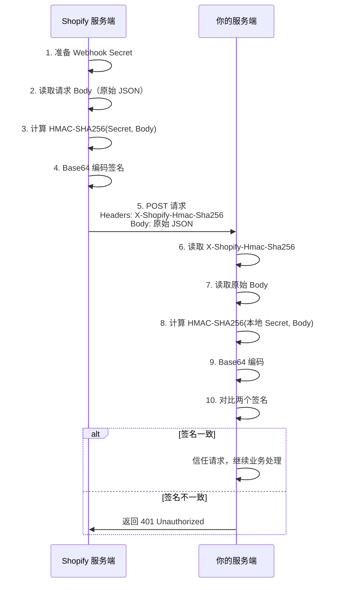
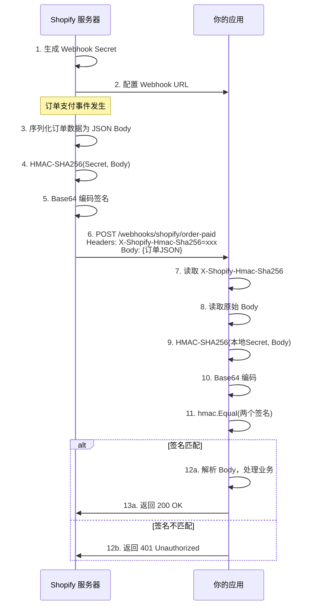

# Shopify Webhook HMAC-SHA256 签名验证详解

[English](shopify_verify.md)

> 文档日期：2026-07-04

---

## 一、X-Shopify-Hmac-Sha256 是什么

`X-Shopify-Hmac-Sha256` 是 **Shopify Webhook 的签名验证请求头**，用于确保 webhook 请求确实来自 Shopify 官方服务器，而不是第三方伪造的攻击请求。

它是 Shopify 在发送每个 webhook 请求时，使用 **HMAC-SHA256** 算法对请求体（Body）进行签名后生成的 Base64 编码字符串。

---

## 二、为什么需要签名验证

| 风险场景 | 说明 | 后果 |
|----------|------|------|
| **伪造请求** | 攻击者直接调用你的 webhook 接口，构造虚假订单数据 | 会员被错误注册，积分被恶意发放 |
| **重放攻击** | 拦截合法请求重复发送 | 同一笔订单重复赚取积分 |
| **数据篡改** | 中间人修改请求内容 | 把 $10 订单改成 $1000，多发放积分 |
| **接口暴露** | Webhook URL 是公开的，任何人可访问 | 未验证的请求直接操作业务数据 |

HMAC 签名验证的核心价值：**只有持有相同 Secret 的双方才能生成匹配的签名**，攻击者无法伪造。

---

## 三、签名计算原理

### 3.1 算法流程



### 3.2 数学公式

```
Signature = Base64( HMAC-SHA256( WebhookSecret, RequestBody ) )
```

其中：
- `HMAC-SHA256`：基于 SHA-256 哈希的消息认证码算法
- `WebhookSecret`：Shopify 生成的密钥（只有 Shopify 和你知道）
- `RequestBody`：HTTP 请求的原始 Body 字节流
- `Base64`：将二进制结果编码为可传输的字符串

---

## 四、代码实现

### 4.1 完整验证中间件

```go
package handler

import (
    "crypto/hmac"
    "crypto/sha256"
    "encoding/base64"
    "encoding/json"
    "io"
    "net/http"

    "github.com/gin-gonic/gin"
    "loyalty-system/internal/pkg/response"
    "loyalty-system/pkg/broker"
)

// WebhookHandler 处理 Shopify Webhook
type WebhookHandler struct {
    broker        *broker.Broker
    webhookSecret string  // 从 Shopify 后台获取的密钥
}

// NewWebhookHandler 创建 WebhookHandler
func NewWebhookHandler(broker *broker.Broker, secret string) *WebhookHandler {
    return &WebhookHandler{
        broker:        broker,
        webhookSecret: secret,
    }
}

// VerifyShopifyWebhook 验证 Shopify Webhook 签名
// 作为 Gin 中间件使用，签名验证通过后才执行后续 Handler
func (h *WebhookHandler) VerifyShopifyWebhook(c *gin.Context) {
    // 步骤 1: 获取 Shopify 发来的 HMAC 签名头
    hmacHeader := c.GetHeader("X-Shopify-Hmac-Sha256")
    if hmacHeader == "" {
        response.Error(c, http.StatusUnauthorized, "missing X-Shopify-Hmac-Sha256 header")
        c.Abort()
        return
    }

    // 步骤 2: 读取原始请求 Body（注意：Body 只能读取一次，需要保存）
    body, err := io.ReadAll(c.Request.Body)
    if err != nil {
        response.Error(c, http.StatusBadRequest, "failed to read request body")
        c.Abort()
        return
    }

    // 将 Body 保存到上下文，供后续 Handler 使用
    c.Set("rawBody", body)

    // 步骤 3: 使用本地存储的 Webhook Secret 重新计算 HMAC
    mac := hmac.New(sha256.New, []byte(h.webhookSecret))
    mac.Write(body)
    expectedMAC := base64.StdEncoding.EncodeToString(mac.Sum(nil))

    // 步骤 4: 使用 hmac.Equal 进行恒定时间比较，防止时序攻击
    if !hmac.Equal([]byte(hmacHeader), []byte(expectedMAC)) {
        response.Error(c, http.StatusUnauthorized, "invalid webhook signature")
        c.Abort()
        return
    }

    // 签名验证通过，继续执行后续 Handler
    c.Next()
}

// HandleOrderPaid 处理订单支付 webhook
func (h *WebhookHandler) HandleOrderPaid(c *gin.Context) {
    // 从上下文中获取之前保存的原始 Body
    rawBody := c.MustGet("rawBody").([]byte)

    var payload struct {
        ID         int64 `json:"id"`
        Customer   struct {
            ID    int64  `json:"id"`
            Email string `json:"email"`
        } `json:"customer"`
        TotalPrice string `json:"total_price"`
        Currency   string `json:"currency"`
        ShopDomain string `json:"shop_domain"`
    }

    if err := json.Unmarshal(rawBody, &payload); err != nil {
        response.BadRequest(c, "invalid payload")
        return
    }

    // 发布到 Kafka 进行异步处理
    eventPayload := map[string]interface{}{
        "order_id":    payload.ID,
        "customer_id": payload.Customer.ID,
        "shop_id":     payload.ShopDomain,
        "email":       payload.Customer.Email,
        "total_price": payload.TotalPrice,
        "currency":    payload.Currency,
    }

    if err := h.broker.Publish(c.Request.Context(), broker.EventTypeOrderPaid, payload.ShopDomain, eventPayload); err != nil {
        response.InternalError(c, "publish event failed")
        return
    }

    // 必须返回 200，否则 Shopify 会认为投递失败并重试
    response.Success(c, gin.H{"status": "accepted"})
}
```

### 4.2 路由注册

```go
// main.go 或 router.go
webhook := r.Group("/webhooks")
{
    // 先执行签名验证中间件，再执行业务处理
    webhook.POST("/shopify/order-paid", 
        webhookHandler.VerifyShopifyWebhook,  // 签名验证
        webhookHandler.HandleOrderPaid)        // 业务处理
}
```

---

## 五、关键安全要点

### 5.1 使用 hmac.Equal 而非字符串比较

```go
// ❌ 错误：使用字符串比较，存在时序攻击风险
if hmacHeader != expectedMAC { ... }

// ✅ 正确：使用 hmac.Equal，恒定时间比较
if !hmac.Equal([]byte(hmacHeader), []byte(expectedMAC)) { ... }
```

**时序攻击原理**：字符串比较会在第一个不匹配字符处停止，攻击者可以通过测量响应时间差异逐字节推断出正确签名。

### 5.2 Body 只能读取一次

Go 的 `http.Request.Body` 是一个 `io.ReadCloser`，读取后会被消耗。因此：

1. 在中间件中读取 Body
2. 将原始字节保存到 `gin.Context`
3. 后续 Handler 从 Context 中获取

```go
// 中间件中读取并保存
body, _ := io.ReadAll(c.Request.Body)
c.Set("rawBody", body)

// 后续 Handler 中使用
rawBody := c.MustGet("rawBody").([]byte)
```

### 5.3 Webhook Secret 的安全存储

| 存储方式 | 安全性 | 推荐度 |
|----------|--------|--------|
| 环境变量 | 中 | ⭐⭐⭐ 推荐 |
| 配置文件（加密） | 中 | ⭐⭐⭐ |
| 密钥管理服务（AWS KMS / Azure Key Vault） | 高 | ⭐⭐⭐⭐⭐ 生产环境 |
| 硬编码在代码中 | 极低 | ❌ 禁止 |
| 提交到 Git | 极低 | ❌ 禁止 |

```yaml
# configs/config.yaml
shopify:
  webhook_secret: ${SHOPIFY_WEBHOOK_SECRET}  # 从环境变量注入
```

```bash
# 启动时注入
export SHOPIFY_WEBHOOK_SECRET="whsec_xxxxxxxxxxxxxxxx"
```

---

## 六、Shopify 相关请求头说明

| 请求头 | 说明 | 示例 |
|--------|------|------|
| `X-Shopify-Hmac-Sha256` | HMAC-SHA256 签名 | `h8q8d9f7...` |
| `X-Shopify-Topic` | Webhook 主题/事件类型 | `orders/paid` |
| `X-Shopify-Shop-Domain` | 发送请求的店铺域名 | `demo-shop.myshopify.com` |
| `X-Shopify-Webhook-Id` | Webhook 唯一 ID | `shpat_xxx...` |
| `X-Shopify-Triggered-At` | 触发时间 | `2026-07-04T10:30:00Z` |
| `X-Shopify-Api-Version` | API 版本 | `2024-01` |

---

## 七、常见问题

### Q1: 签名验证失败怎么办？

检查以下几点：
1. **Secret 是否正确** — 是否使用了对应 webhook 的 Secret
2. **Body 是否原始** — 是否对 Body 进行了格式化/修改
3. **编码是否一致** — 确保使用 Base64 编码
4. **Secret 是否包含多余空格** — 复制时容易带入换行或空格

### Q2: 如何获取 Webhook Secret？

在 Shopify Partner Dashboard 中：
1. 进入应用设置 → Notifications
2. 创建 Webhook 订阅
3. 在 webhook 详情页查看 **Secret**

### Q3: 是否需要验证其他请求头？

建议同时验证：
- `X-Shopify-Topic` — 确保处理正确的事件类型
- `X-Shopify-Shop-Domain` — 确保来自预期的店铺

### Q4: 验证失败后 Shopify 会怎样？

如果返回非 200 状态码，Shopify 会认为投递失败：
- 立即进行 **19 次重试**
- 重试间隔逐渐延长（1s, 2s, 4s, 8s...）
- 超过 24 小时仍未成功则放弃

因此验证失败时应返回 **401 Unauthorized**，让 Shopify 停止重试非法请求。

---

## 八、完整验证流程图



---

## 九、参考链接

- [Shopify Webhook 官方文档](https://shopify.dev/docs/apps/webhooks)
- [Shopify Webhook 签名验证指南](https://shopify.dev/docs/apps/webhooks/configuration/https#step-5-verify-the-webhook)
- [HMAC (Hash-based Message Authentication Code)](https://en.wikipedia.org/wiki/HMAC)
- [Go crypto/hmac 包文档](https://pkg.go.dev/crypto/hmac)

---

*文档版本：v1.0 | 最后更新：2026-07-04*
