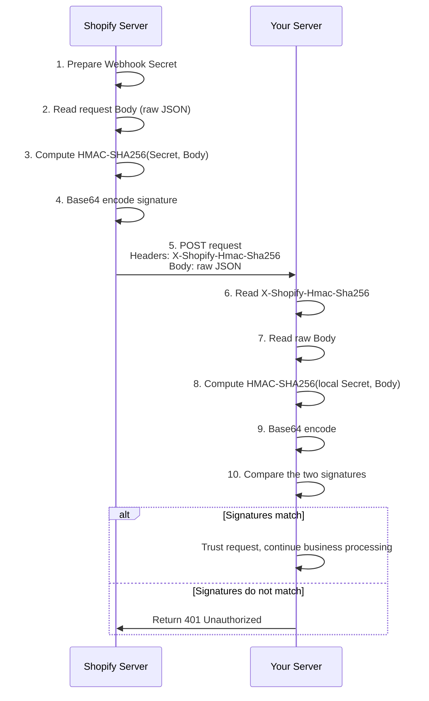
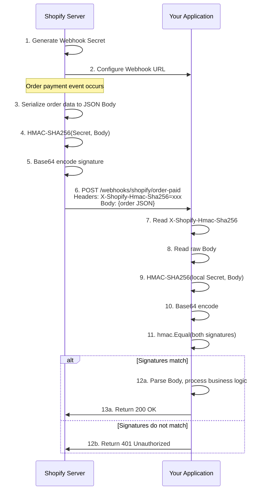

# Shopify Webhook HMAC-SHA256 Signature Verification Explained

[中文](shopify_verify.cn.md)

> Document Date: 2026-07-04

---

## 1. What is X-Shopify-Hmac-Sha256

`X-Shopify-Hmac-Sha256` is the **signature verification header for Shopify Webhooks**, used to ensure that webhook requests actually come from Shopify's official servers rather than forged attack requests from third parties.

It is a Base64-encoded string generated by Shopify when sending each webhook request, using the **HMAC-SHA256** algorithm to sign the request body.

---

## 2. Why Signature Verification is Needed

| Risk Scenario | Description | Consequence |
|---------------|-------------|-------------|
| **Forged Request** | An attacker directly calls your webhook endpoint with fake order data | Members are incorrectly registered and points are maliciously issued |
| **Replay Attack** | Legitimate requests are intercepted and resent repeatedly | The same order earns points multiple times |
| **Data Tampering** | A man-in-the-middle modifies request content | A $10 order is changed to $1000, issuing extra points |
| **Exposed Endpoint** | Webhook URLs are public and accessible to anyone | Unverified requests directly manipulate business data |

The core value of HMAC signature verification: **only both parties holding the same Secret can generate matching signatures**, which attackers cannot forge.

---

## 3. Signature Calculation Principle

### 3.1 Algorithm Flow



### 3.2 Mathematical Formula

```
Signature = Base64( HMAC-SHA256( WebhookSecret, RequestBody ) )
```

Where:
- `HMAC-SHA256`: Hash-based Message Authentication Code algorithm using SHA-256
- `WebhookSecret`: The secret key generated by Shopify (known only to Shopify and you)
- `RequestBody`: The raw byte stream of the HTTP request body
- `Base64`: Encodes the binary result into a transmittable string

---

## 4. Code Implementation

### 4.1 Complete Verification Middleware

```go
package handler

import (
    "crypto/hmac"
    "crypto/sha256"
    "encoding/base64"
    "encoding/json"
    "io"
    "net/http"

    "github.com/gin-gonic/gin"
    "loyalty-system/internal/pkg/response"
    "loyalty-system/pkg/broker"
)

// WebhookHandler handles Shopify Webhooks
type WebhookHandler struct {
    broker        *broker.Broker
    webhookSecret string  // Secret obtained from Shopify admin
}

// NewWebhookHandler creates a WebhookHandler
func NewWebhookHandler(broker *broker.Broker, secret string) *WebhookHandler {
    return &WebhookHandler{
        broker:        broker,
        webhookSecret: secret,
    }
}

// VerifyShopifyWebhook verifies the Shopify Webhook signature
// Used as a Gin middleware; subsequent handlers execute only after signature verification passes
func (h *WebhookHandler) VerifyShopifyWebhook(c *gin.Context) {
    // Step 1: Get the HMAC signature header sent by Shopify
    hmacHeader := c.GetHeader("X-Shopify-Hmac-Sha256")
    if hmacHeader == "" {
        response.Error(c, http.StatusUnauthorized, "missing X-Shopify-Hmac-Sha256 header")
        c.Abort()
        return
    }

    // Step 2: Read the raw request Body (note: Body can only be read once, so save it)
    body, err := io.ReadAll(c.Request.Body)
    if err != nil {
        response.Error(c, http.StatusBadRequest, "failed to read request body")
        c.Abort()
        return
    }

    // Save Body to context for subsequent handlers
    c.Set("rawBody", body)

    // Step 3: Recompute HMAC using the locally stored Webhook Secret
    mac := hmac.New(sha256.New, []byte(h.webhookSecret))
    mac.Write(body)
    expectedMAC := base64.StdEncoding.EncodeToString(mac.Sum(nil))

    // Step 4: Use hmac.Equal for constant-time comparison to prevent timing attacks
    if !hmac.Equal([]byte(hmacHeader), []byte(expectedMAC)) {
        response.Error(c, http.StatusUnauthorized, "invalid webhook signature")
        c.Abort()
        return
    }

    // Signature verified, continue to subsequent handlers
    c.Next()
}

// HandleOrderPaid handles the order paid webhook
func (h *WebhookHandler) HandleOrderPaid(c *gin.Context) {
    // Get the previously saved raw Body from context
    rawBody := c.MustGet("rawBody").([]byte)

    var payload struct {
        ID         int64 `json:"id"`
        Customer   struct {
            ID    int64  `json:"id"`
            Email string `json:"email"`
        } `json:"customer"`
        TotalPrice string `json:"total_price"`
        Currency   string `json:"currency"`
        ShopDomain string `json:"shop_domain"`
    }

    if err := json.Unmarshal(rawBody, &payload); err != nil {
        response.BadRequest(c, "invalid payload")
        return
    }

    // Publish to Kafka for asynchronous processing
    eventPayload := map[string]interface{}{
        "order_id":    payload.ID,
        "customer_id": payload.Customer.ID,
        "shop_id":     payload.ShopDomain,
        "email":       payload.Customer.Email,
        "total_price": payload.TotalPrice,
        "currency":    payload.Currency,
    }

    if err := h.broker.Publish(c.Request.Context(), broker.EventTypeOrderPaid, payload.ShopDomain, eventPayload); err != nil {
        response.InternalError(c, "publish event failed")
        return
    }

    // Must return 200, otherwise Shopify considers delivery failed and retries
    response.Success(c, gin.H{"status": "accepted"})
}
```

### 4.2 Route Registration

```go
// main.go or router.go
webhook := r.Group("/webhooks")
{
    // Execute signature verification middleware first, then business logic
    webhook.POST("/shopify/order-paid", 
        webhookHandler.VerifyShopifyWebhook,  // Signature verification
        webhookHandler.HandleOrderPaid)        // Business processing
}
```

---

## 5. Key Security Points

### 5.1 Use hmac.Equal Instead of String Comparison

```go
// ❌ Wrong: string comparison, vulnerable to timing attacks
if hmacHeader != expectedMAC { ... }

// ✅ Correct: use hmac.Equal for constant-time comparison
if !hmac.Equal([]byte(hmacHeader), []byte(expectedMAC)) { ... }
```

**Timing Attack Principle**: String comparison stops at the first mismatched character. Attackers can infer the correct signature byte by byte by measuring response time differences.

### 5.2 Body Can Only Be Read Once

Go's `http.Request.Body` is an `io.ReadCloser`; it is consumed after reading. Therefore:

1. Read the Body in the middleware
2. Save the raw bytes to `gin.Context`
3. Subsequent handlers retrieve it from the context

```go
// Read and save in middleware
body, _ := io.ReadAll(c.Request.Body)
c.Set("rawBody", body)

// Use in subsequent handlers
rawBody := c.MustGet("rawBody").([]byte)
```

### 5.3 Secure Storage of Webhook Secret

| Storage Method | Security | Recommendation |
|----------------|----------|----------------|
| Environment variable | Medium | ⭐⭐⭐ Recommended |
| Config file (encrypted) | Medium | ⭐⭐⭐ |
| Key management service (AWS KMS / Azure Key Vault) | High | ⭐⭐⭐⭐⭐ Production |
| Hard-coded in code | Very low | ❌ Prohibited |
| Committed to Git | Very low | ❌ Prohibited |

```yaml
# configs/config.yaml
shopify:
  webhook_secret: ${SHOPIFY_WEBHOOK_SECRET}  # Injected from environment variable
```

```bash
# Inject at startup
export SHOPIFY_WEBHOOK_SECRET="whsec_xxxxxxxxxxxxxxxx"
```

---

## 6. Shopify-related Request Headers

| Header | Description | Example |
|--------|-------------|---------|
| `X-Shopify-Hmac-Sha256` | HMAC-SHA256 signature | `h8q8d9f7...` |
| `X-Shopify-Topic` | Webhook topic/event type | `orders/paid` |
| `X-Shopify-Shop-Domain` | Store domain sending the request | `demo-shop.myshopify.com` |
| `X-Shopify-Webhook-Id` | Webhook unique ID | `shpat_xxx...` |
| `X-Shopify-Triggered-At` | Trigger time | `2026-07-04T10:30:00Z` |
| `X-Shopify-Api-Version` | API version | `2024-01` |

---

## 7. FAQ

### Q1: What if signature verification fails?

Check the following:
1. **Is the Secret correct?** — Are you using the Secret for the corresponding webhook?
2. **Is the Body raw?** — Has the Body been formatted/modified?
3. **Is the encoding consistent?** — Ensure Base64 encoding is used
4. **Does the Secret contain extra whitespace?** — Copying can introduce newlines or spaces

### Q2: How to obtain the Webhook Secret?

In the Shopify Partner Dashboard:
1. Go to App settings → Notifications
2. Create a webhook subscription
3. View the **Secret** on the webhook details page

### Q3: Should other headers be verified?

It is recommended to also verify:
- `X-Shopify-Topic` — Ensure the correct event type is being processed
- `X-Shopify-Shop-Domain` — Ensure it comes from the expected store

### Q4: What does Shopify do after verification failure?

If a non-200 status code is returned, Shopify considers delivery failed:
- **19 immediate retries**
- Retry intervals gradually increase (1s, 2s, 4s, 8s...)
- Abandoned after 24 hours if still unsuccessful

Therefore, when verification fails, return **401 Unauthorized** so Shopify stops retrying invalid requests.

---

## 8. Complete Verification Flow Diagram



---

## 9. Reference Links

- [Shopify Webhook Official Documentation](https://shopify.dev/docs/apps/webhooks)
- [Shopify Webhook Signature Verification Guide](https://shopify.dev/docs/apps/webhooks/configuration/https#step-5-verify-the-webhook)
- [HMAC (Hash-based Message Authentication Code)](https://en.wikipedia.org/wiki/HMAC)
- [Go crypto/hmac Package Documentation](https://pkg.go.dev/crypto/hmac)

---

*Document Version: v1.0 | Last Updated: 2026-07-04*
